## 202204

- Spring体系架构

- Spring程序开发

  


## 202207

### 01

#### Spring配置文件

- attribute
  - **id**
  - **class**
  - scope
  - **property**

### 02

#### Spring配置文件

- life_cycle
  - init_method
  - destroy_method
- initialize_method
  - deafult
  - StaticFactory
  - DynamicFactory
- DependencyInjection
  - Ways
    - **Property**
    - ConstructorArg[第三方框架整合]
  - DataType
    - basic
    - **point**
    - array
      - map: key, value-ref
      - properties
- 分模块开发
  - import resource

#### SpringAPI

- 加载IOC容器

  - ClassPathXmlAC

  - FileSystemXmlAC
    - 不常用

  - AnnotationConfigAC

#### Spring配置数据源

- DataSource
  - bean
    - driver
    - jdbc
    - user
    - password
  - properties
    - context
    - location
    - system-properties-mode


#### Spring注解开发

- 定义bean

  - @Component

    让实体类变成Bean

  - context:component-scan

    > 在xml文件配置了<context:component-scan>标签后，spring容器可以自动去扫描base-pack所指定的包或其子包下面的java类文件，如果扫描到有@Component、@Controller、@Service 、@Repository等注解修饰的Java类，则将这些类注册为spring容器中的bean。

  - @Controller

  - @Service

  - @Repository

  

#### Spring纯注解开发

- @Configuration
- @ComponentScan("com.itheima")
- AnnotationConfigApplicationContext new(SpringConfig.class)

### 03

#### Bean管理

- LifeCycle

  - @Scope

  - @PostConstruct

  - @PreDestroy

- DI

  - @Autowired

  - @Qualifier

  - @Value

  - @Property

- 使用独立的配置类管理第三方bean

  - @ComponentScan()+@Configuration

    不推荐

  - @Import(xxx.class)

  - @Bean

    引用型依赖注入
    
    > However, they are most often used with `@Configuration` beans.
    
  - 外部资源：参数传入

- 总结

  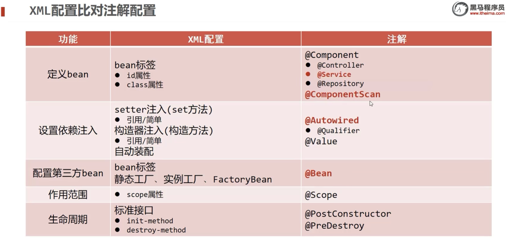


### 06

#### 整合Mybatis

- dependency

  - mybatis
  - spring-jdbc
  - mybatis-spring

- config

  - SpringConfig

  - JdbcConfig

    - 为什么用@Update这些注解？
    - 为什么用@Value，与DataSource的关系？
  
  - MybatisConfig[add]
  
    - @Bean
      - sqlSessionFactory
      - mapperScannerConfigurer
  
    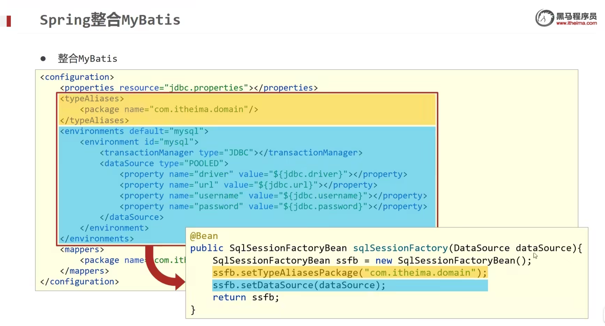
  
    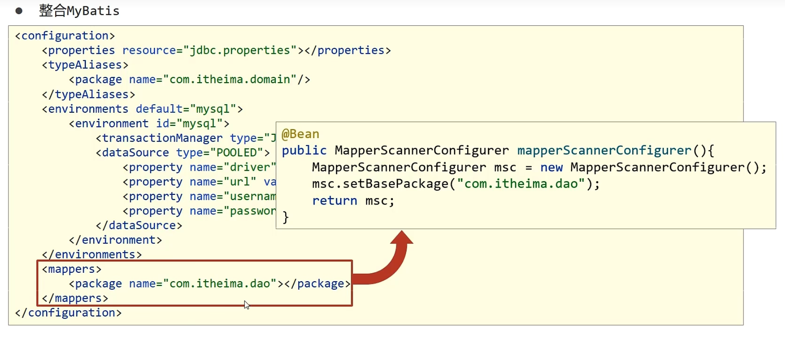
  
  - [mybatis入门](https://mybatis.org/mybatis-3/zh/getting-started.html)
  
  
  
  ### 整合junit
  
  - dependency
    - junit
    - spring-test
  - test.java
    - @RunWith
    - @ContextConfiguration
    - @Autowired
    - @Test


### 07

#### AOP概念

> [SpringAOP](https://docs.spring.io/spring-framework/docs/2.5.x/reference/aop.html)
>
> [廖雪峰_使用AOP](https://www.liaoxuefeng.com/wiki/1252599548343744/1266265125480448)

- AOP核心概念

  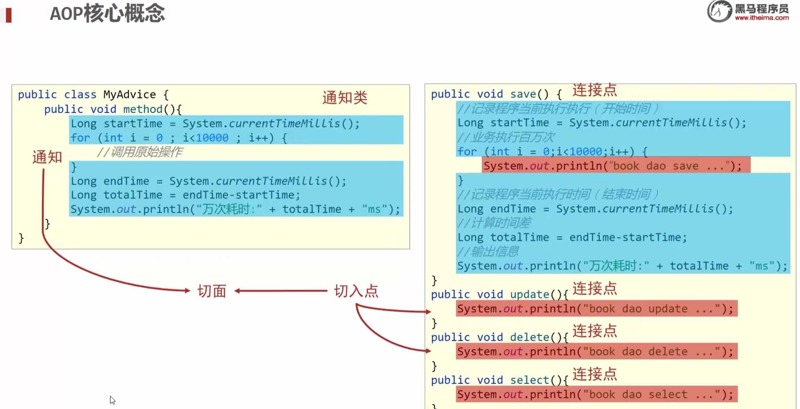

- 步骤

  - 导入坐标（pox.xml）
  - 制作连接点方法（原始操作，Dao接口与实现类）
  - myAdvice
    - 制作共性功能（通知/通知类）
    - 定义切入点
      - @Pointcut("execution(.......)")
      - private void pc(){}
    - 绑定切入点与通知的关系（切面）
      
      @Before("pc()")
    - @Component
    - @Aspect
  - SpringConfig
    - @EnableAspectJAutoProxy

- 工作流程

  - Spring容器启动
  - 读取所有`切面配置`中的切入点
  - 初始化bean，判定bean对应的类中的方法是否匹配到任意切入点
    - 匹配失败，创建对象
    - 匹配成功，创建原始对象（目标对象）的代理对象
  - 获取bean执行方法
    - 获取bean，调用方法并执行，完成操作
    - 获取bean是代理对象

- 本质

  - 目标对象（Target）
  - 代理（Proxy）

- 切入点表达式

  - 切入点：要增强的方法

  - 切入点表达式：要进行增强的方法的描述方式

    - 基于接口实现的动态代理，基于cglib（父类实现）的动态代理

  - 切入点表达式的标准格式

    - 返回值可以是自定义的类吗？

  - 通配符

    > *
    >
    > ..
    >
    > +

  - 书写规范：精准与高效

    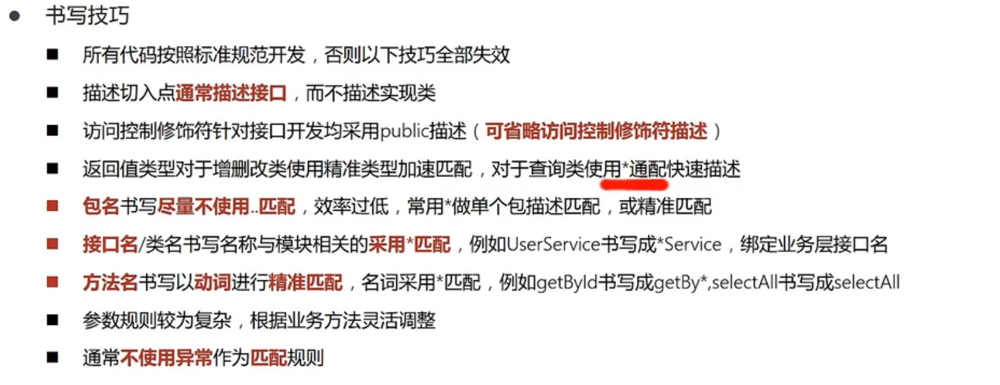

- AdviceTypes

  - @Around, ProceedingJoinPoint, throws Throwable

    - 权限校验，隔离，不想让你调用原始方法
    
    - 因为不知道原始方法是否会抛出异常，所以Around必须抛出Throwable对象

  - 返回值Object

    - 如果不接收返回值，用void即可；如果接收返回值，必须设定为Object

  - @AfterReturning

  - @AfterThrowing

    > @After和@AfterReturning的区别，https://blog.csdn.net/Tom098/article/details/105883301

### 09

#### AOP业务测试

- pjp.getSignature();

#### AOP通知获取数据

- 相同的大量使用的功能

 

### 10

#### 事务案例

- JdbcConfig
  - PlatformTransactionManager, DataSourceTransactionManager
- SpringConfig
  - @EnableTransactionManagement
- Account.java约定是什么？
- Dao和Service注解的区分
  - @Transactional通常写在ServiceInterface中，而不是添加到ServiceImpl里，降低耦合。
  - @Transactional添加到方法上，表示方法开启事务；添加到接口上，表示接口的所有方法开启事务。

#### 事务实现

- 事务管理员，事务协调员

  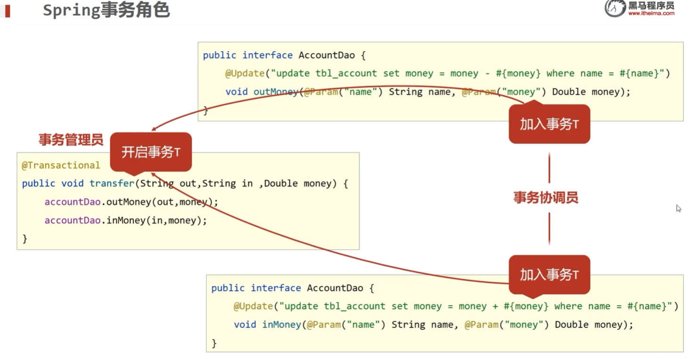

  - 管理员：通常指Service开启事务的方法
  - 协调员：通常指Dao方法，也可以是Service方法

#### 事务属性

- readOnly

- **rollbackFor**

  ```java
  @Transactional(rollbackFor = {IOException.class})
  ```

  > IOException属于编译异常，也叫ckeckedException
  >
  > 默认只有运行时异常（NullPointException）和Error（通常是虚拟机报错，如内存溢出）才会进行事务回滚

- try finally

- 可以用AOP吗

- 事务传播行为propagation

  ```java
  @Transacitonal(propagation = Propagation.REQUIRES_NEW)
  ```

  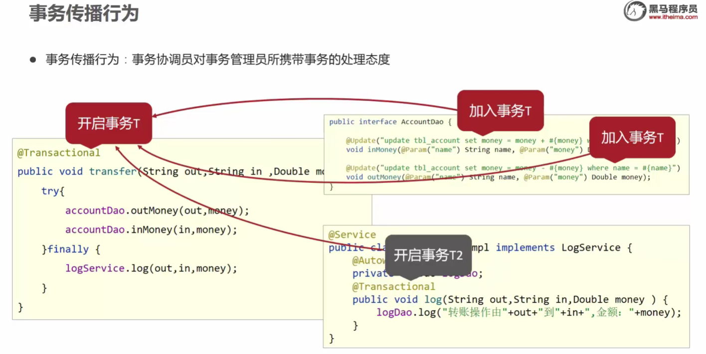

  汇总：

  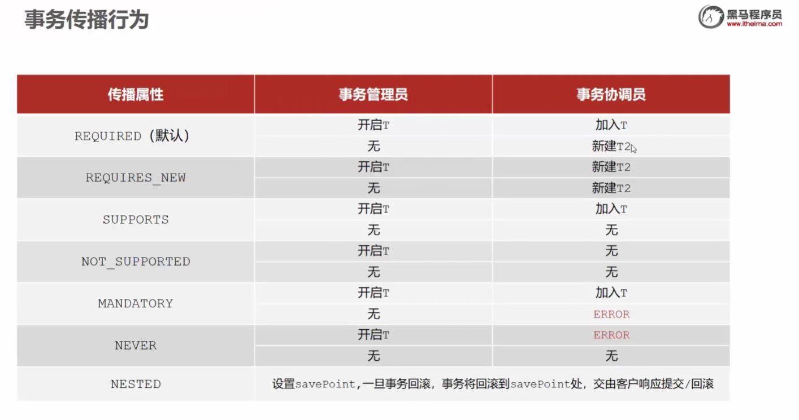


#### SpringMVC简介

- 目标

  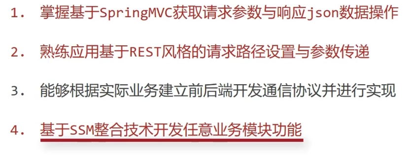

- 概述

  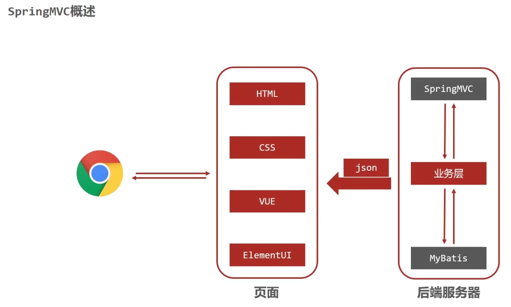

- 基于Java实现MVC模型的轻量级web框架

- 入门案例

- 入门案例工作流程分析

  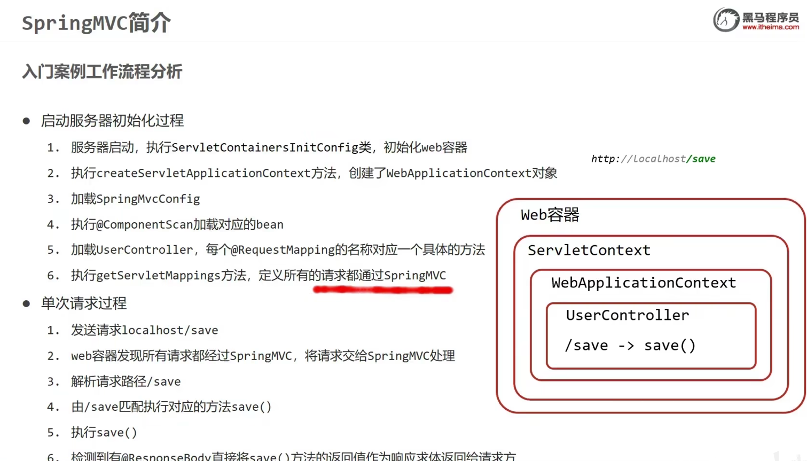

  > Mybatis接口，没有实现类：
  >
  > 回答：开发mybatis时用的是自动代理创建的实现类，所以dao没有impl

- Controller加载控制与业务bean加载控制

  - @ComponentScan

    - excludeFilters
    - FilterType.ANNOTATION

  - WEB配置简化开发

    - AbstractDispatcherServletInitializer——AbstractAnnotationConfigDispatcherServletInitializer

      > 用处是什么AbstractDispatcherServletInitializer？

    - createServletApplicationContext——getServletConfigClasses

    - createRootApplicationContext——getRootConfigClasses

    - getServletMappings——getServletMappings

#### 请求与响应

- 请求映射路径

  - 请求路径前缀

    > 怎么修改tomcat的端口

- 请求参数

  - Get

  - Post

  - 乱码处理：过滤器

    - getServletFilters()
      - CharacterEncodingFilter

  - 传参方式

    - @RequestParam("name") String userName

      绑定请求参数和形参的关系

    - pojoParam()，与实体类形参匹配，则自动注入属性

    - pojoContainPojoParam()，用得少

    - arrayParam

    - listParam，相比arrayParam多了@RequestParam

- 相应json数据

  - SpringMvcConfig：**@EnableWebMvc**，将json转换成对象
  - **@RequestBody**
  - 传参类型
    - listParamForJson
    - pojoParamForJson
    - listPojoParamForJson

- 日期类型参数传递

  - @DateTimeFormat(pattern="yyyy-MM-dd")
  - Converter
    - String2Integer
    - String2Date

- 响应

  - 响应页面
  - 响应数据
    - 文本数据
    - **json数据**
      - @ReponseBody, return user
      - @ReponseBody, return userList
  - @ResponseBody
    - 作用：设置当前控制器返回值作为响应体
      - HttpMessageConverter<--AbstractJackson2HttpMessageConverter

### 11

#### REST风格

- 行为动作区分

  > 从boot过来恍然大悟？

- @RequestMappint(value = "/users/{id}",method = RequestMethod.GET)

  - @PathVariable Integer id

  > 怎么删除多个？

  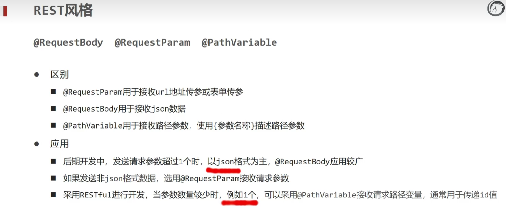

  大量用：多个要提交的数据封装成POJO，然后用json串传输

- REST快速开发
  - @RestController
    - @ResponseBody，接JSON数据
    - @Controller
  - @PostMapping
  - @DeleteMapping("/{id}")
  - @PutMapping
  - @GetMapping("/{id}")
  - @GetMapping()
- REST案例
  - 增post，删delete，改put，查get

### 12

#### REST页面交互

- addResourceHandlers
- .........完全不会了，代码跑不通？


#### SSM整合

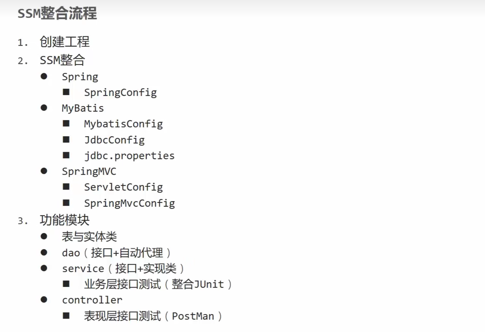

- Spring整合Mybatis

  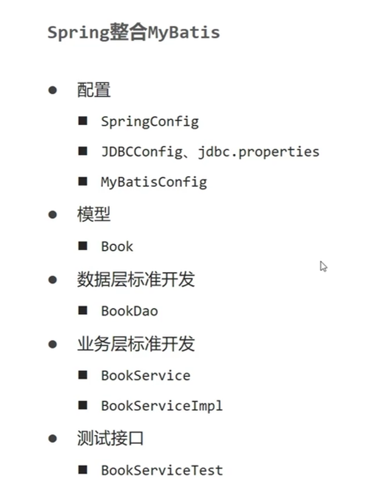

- 步骤1-39


#### 表现层数据封装

- 封装模型

  ```java
  public class Result {
    private Object data;
    private Integer code;
    private String msg;
  }
  ```

  


异常处理器

项目异常处理方案

拦截器


